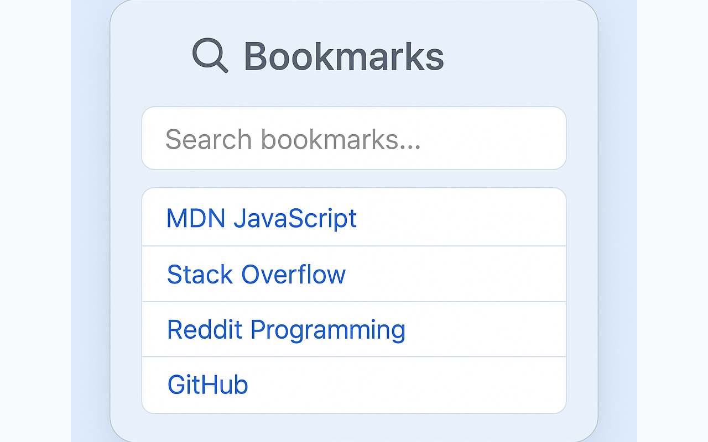

# 🔖 Bookmark Search – Chrome Extension

A lightweight, privacy-friendly Chrome extension that lets you search your browser bookmarks quickly and efficiently — all locally.

## 🚀 Features

- 🔍 Real-time keyword search
- 📁 Supports all bookmark folders
- 🧭 Clean and minimal UI
- 🛡️ No data collection, no tracking, 100% local

## 📷 Screenshots

## 🔐 Privacy Policy

This extension does **not collect any user data**.  
Full privacy policy available here:  
[https://insuckcha.github.io/bookmark-search-extension/privacy.html](https://insuckcha.github.io/bookmark-search-extension/privacy.html)

## 📦 Installation

**Coming soon on the [Chrome Web Store](https://chrome.google.com/webstore/category/extensions)**

Or install manually:

1. Clone or download this repo
2. Go to `chrome://extensions/`
3. Enable **Developer mode**
4. Click **Load unpacked**
5. Select this project folder

## 📄 Permissions

- `bookmarks`: Used to access and search your browser bookmarks locally.

## 📧 Contact

Have questions or suggestions?  
Open an issue or email `insuckcha@gmail.com`.

---

Made with ❤️ by [@insuckcha](https://github.com/insuckcha)
